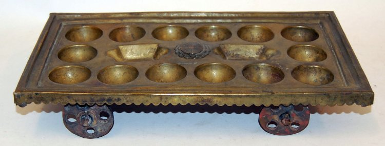
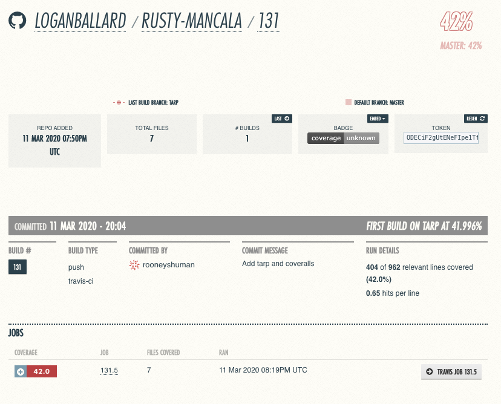
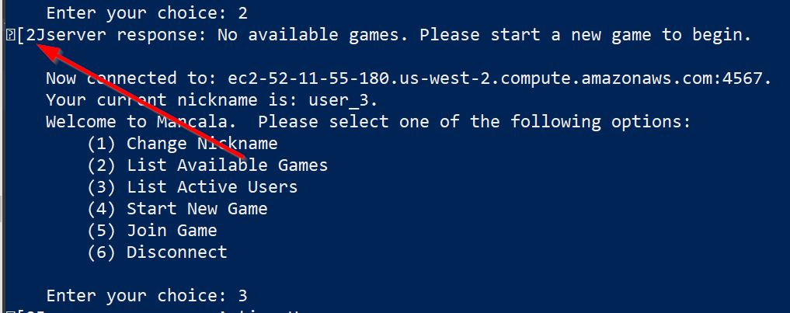

[](https://travis-ci.org/loganballard/rusty-mancala)
[](https://coveralls.io/github/loganballard/rusty-mancala)

# Rusty Mancala



### Overview

Rusty Mancala is a basic implementation of the standard rules of [Mancala](https://en.wikipedia.org/wiki/Mancala). It
is mostly an exercise to learn the Rust programming language and TCP communication protocols.

## How to Use

0. Make sure you have the `rustup` [toolchain installed](https://rustup.rs/)
1. Clone this repo
1. Build the binary
   - `$ cargo build --release`
1. Alternatively, there may be a usable binary on this repo already if we've been extra diligent. You can just download that.

##### To Run Locally

1. In a terminal, run the binary in server mode. This will spin up a local server instance
   - `$ ./release/rusty-mancala{.exe} -s [PORT NUMBER]`
   - To run with logging enabled, add `-d{dd}` flags. More `d`s is more verbose.
2. In a separate terminal, run the client. The default (no command line flags) command line will run the client.
   - `$ ./release/rusty-mancala{.exe}`
3. Enter localhost and the port number you specified earlier
4. Repeat step 2-3 with more terminal windows

##### To Run Against our Cloud Deployment

1. In a terminal, run the client
   - `$ ./release/rusty-mancala{.exe}`
2. Enter host: `ec2-52-11-55-180.us-west-2.compute.amazonaws.com`
3. Enter port: `4567`
4. Look for a game, change your nickname, or start your own game!

##### Notes on Cargo Run

To use `cargo run` as a shorthand for building the binary and running it, you may have to be clever to pass command line
flags to the binary and not the `cargo` build system. For example, on windows, `cargo run` is problematic:

```
PS> cargo run -s 1234
    Finished dev [unoptimized + debuginfo] target(s) in 0.09s
     Running `target\debug\rusty-mancala.exe -s`
error: Found argument 's' which wasn't expected, or isn't valid in this context

USAGE:
    rusty-mancala.exe [FLAGS] [OPTIONS]

For more information try --help
```

but running with `cargo run -- -s 1234` works. [See this thread.](https://stackoverflow.com/questions/15780174/powershell-command-line-parameters-and)

```
PS> cargo run -- -s  1234
    Finished dev [unoptimized + debuginfo] target(s) in 0.07s
     Running `target\debug\rusty-mancala.exe -s 1234`
2020-03-05 13:10:45,685 INFO  [rusty_mancala::server] Server listening on 0.0.0.0:1234
```

##### Example usage:

```
$ cargo run
    Finished dev [unoptimized + debuginfo] target(s) in 0.48s
     Running `target\debug\rusty-mancala.exe`
run client
Enter a host: ec2-52-11-55-180.us-west-2.compute.amazonaws.com
Enter a port: 4567

    Now connected to: ec2-52-11-55-180.us-west-2.compute.amazonaws.com:4567.
    Your current nickname is: new_nick.
    Welcome to Mancala.  Please select one of the following options:
        (1) Change Nickname
        (2) List Available Games
        (3) List Active Users
        (4) Start New Game
        (5) Join Game
        (6) Disconnect

    Enter your choice: 3

server response: Active Users:
user_9
user_10
user_2
user_1
user_8
user_3
user_4
new_nick
user_5
```

##### Rules of Mancala

If you are unfamiliar with the rules of Mancala, please see
[this lovely instructables article](https://www.instructables.com/id/How-to-play-MANCALA/).

### Playing Rusty Mancala

After creation your own game, you'll be put into a holding pattern until another user joins your game:

```
    Waiting for another player...
```

When you get another player, player 1 will be presented with a screen showing their options:

```
Current game state:
           #13: 4 | #12: 4 | #11: 4 | #10: 4 |  #9: 4 | #8: 4
        0 --------+--------+--------+--------+--------+-------- 0
            #1: 4 |  #2: 4 |  #3: 4 |  #4: 4 |  #5: 4 | #6: 4
Player 1, enter your move (1 - 6)
```

Player 1 then selects a slot to move their stones around the board from. Meanwhile, player two is awaiting their turn
patiently:

```
Current game state:
            #6: 4 |  #5: 4 |  #4: 4 |  #3: 4 |  #2: 4 | #1: 4
        0 --------+--------+--------+--------+--------+-------- 0
            #8: 4 |  #9: 4 | #10: 4 | #11: 4 | #12: 4 | #13: 4


        Waiting for my turn...
```

Player 1 can make a move, and if it results in the turns changing, then it will be player 2's turn. Let's say player 1
moves slot 5, which results in a change to Player 2's turn.

Now player 1 sees:

```
Current game state:
           #13: 4 | #12: 4 | #11: 4 | #10: 4 |  #9: 5 | #8: 5
        0 --------+--------+--------+--------+--------+-------- 1
            #1: 4 |  #2: 4 |  #3: 4 |  #4: 4 |  #5: 0 | #6: 5


        Waiting for my turn...
```

The board's changes are reflected for player 2 and it is now their turn!

```
Current game state:
            #6: 5 |  #5: 0 |  #4: 4 |  #3: 4 |  #2: 4 | #1: 4
        1 --------+--------+--------+--------+--------+-------- 0
            #8: 5 |  #9: 5 | #10: 4 | #11: 4 | #12: 4 | #13: 4
Player 2, enter your move (8 - 13)

```

This proceeds until the game is finished, at which point both players are returned to the lobby.

## Details

This project is largely implemented via Rust's [TcpStream](https://doc.rust-lang.org/std/net/struct.TcpStream.html) Struct
in the standard library.

## Protocol

A large part of the communication between the client and the server is over a serialized messaging protocol. The
protocol is loosely defined below. See the [Protocol](./mancala_rfc.md) documentation for more details.

#### Message Object

```
{
    status:         Status,
    headers:        Headers,
    command:        Commands,
    game_status:    GameStatus,
    data:           String,
    game_state:     GameState,
}
```

The message object is the serialized struct that is sent in between the client and the server and drives all action. It
is used both in the game and outside of the game. The general workflow is :

- Client collects input from the user - User input is translated into a `Message` struct - Client serializes message and sends to the server - Server ingests message, deserializes into a `Message` struct - Server takes appropriate action based on message - Server generates message to send to client, serializes it - Server sends message to client - Client ingests server response and prompts user for input - Repeat

The fields of the message are described below.

##### Status

```
{
    Ok,
    NotOk,
}
```

Status is an `enum` containing two values: `Ok` and `NotOk`. These are used to communicate errors or successful
actions for server or client.

##### Headers

```
{
    Read,
    Write,
    Response,
}
```

Various headers to indicate how a client or server should handle this message. `Read` messages do not require any updates
to data, so will be handled in a way that doesn't obtain locks or mess with writing. Write data is handled more carefully.
Response data is information given from server to client.

##### Commands

```
{
    InitSetup,
    SetNick,
    ListGames,
    ListUsers,
    MakeNewGame,
    JoinGame,
    LeaveGame,
    GetCurrentGamestate,
    MakeMove,
    GameIsOver,
    KillMe,
    KillClient,
    Reply,
}
```

The commands are used to drive action by the server or the client. In general, the client will ask the server to do
something, and the server will reply with a status that tells the client whether or not that action was successful.

C = Client
S = Server

|       Command       | Direction | Description                                     | payload                      |
| :-----------------: | :-------: | :---------------------------------------------- | :--------------------------- |
|       SetNick       |  C -> S   | Client requests a change to their nickname      | the new nickname             |
|      ListGames      |  C -> S   | Request to return a list of open games          | none                         |
|      ListUsers      |  C -> S   | Request to return a list of active users        | none                         |
|     MakeNewGame     |  C -> S   | Create a new game and add me to it              | text input game name         |
|      JoinGame       |  C -> S   | Request to join an available game               | the id of the game           |
|      LeaveGame      |  C -> S   | Request to leave a game once joined             | none                         |
| GetCurrentGamestate |  C -> S   | Return the current board state                  | none                         |
|      MakeMove       |  C -> S   | While in game, move stones from a slot          | The slot to move stones from |
|     GameIsOver      |  S -> C   | Response when game state has reached "finished" | none                         |
|       KillMe        |  C -> S   | Request to remove client from active lists      | none                         |
|     KillClient      |  S -> C   | Response to end client TCP connection           | none                         |
|        Reply        |  S -> C   | Generic reply format                            | varies                       |

##### Game Status

```
{
    InGame,
    NotInGame
}
```

Game status drives certain code paths. For the client, it determines which screens to render. For the server, it
determines how to route client messages.

##### Data

Data is a text field that contains metadata about the message sent. It can be things like the nickname that the user has
chosen, or an error message that is returned to the client when the server chokes on something.

###### Examples:

New Nickname "nick" Server Success Response:

```
{
    status:         Status::Ok,
    headers:        Headers::Response,
    command:        Commands::SetNick,
    game_status:    GameStatus::NotInGame,
    data:           "nick",
    game_state:     empty,
}
```

New Nickname Server Error Response:

```
{
    status:         NotOk,
    headers:        Response,
    command:        SetNick,
    game_status:    NotInGame,
    data:           "nickname already in use",
    game_state:     empty
}
```

##### Game State

```
{
    player_one:             int,
    player_two:             int,
    game_name:              String,
    game_id:                int,
    game_board:             [],
    player_one_goal_slot:   int,
    player_two_goal_slot:   int,
    player_one_turn:        bool,
    active:                 bool,
    game_over:              bool,
}
```

### Deployment

Server is deployed on AWS. Connect by building the client, and connecting to host
`ec2-52-11-55-180.us-west-2.compute.amazonaws.com` on port `4567`.

## Testing

To measure our test code coverage, we utilized the [`cargo-tarpaulin`](https://crates.io/crates/cargo-tarpaulin) crate. Tarpaulin is a code coverage reporting tool for the Cargo build system. It was added to our Continuous Integration workflow by having our Travis-CI setup send the coverage results to [Coveralls.io](https://coveralls.io/github/loganballard/rusty-mancala) for reporting and visualization.

Below is a sample Coveralls report generated for one of our builds:



## Known Issues

Windows doesn't like the control character used to clear the screen:



This bug doesn't seem to show up when run via `cargo run`, but when run via the compiled binary, it's there.

## Authors

- **Belén Bustamante** - [rooneyshuman](https://github.com/rooneyshuman)
- **Logan Ballard** - [loganballard](https://github.com/loganballard)

## License

Distributed under the MIT License. See [LICENSE](/LICENSE) for more information.
